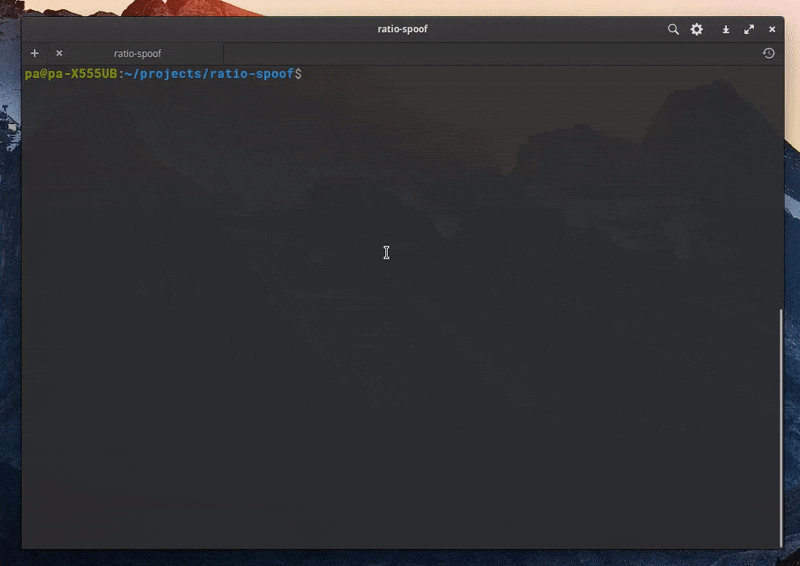

# ratio-spoof
Ratio-spoof is a cross-platform, free and open source tool to spoof the download/upload amount on private bittorrent trackers.



## Motivation
Here in brazil, not everybody has a great upload speed, and most of the private trackers requires a ratio to be greater than or equal to 1 (e.g. if you downloaded 1gb you must upload 1gb as well) in order to survive. Plus, i have always been fascinated by the bittorrent protocol, [i even made a bittorrent webclient to learn a bit about it ](https://github.com/ap-pauloafonso/rwTorrent) so with the current global covid-19 lockdown i got some free time and decided to code my own simple cli tool to spoof bittorrent trackers.

## How does it works?
Bittorrent protocol works in such a way that there is no way that a tracker knows how much certain peer have downloaded or uploaded, so the tracker depends on the peer itself telling the amounts.

Ratio-spoof acts like a normal bittorrent client but without downloading or uploading anything, in fact it just tricks the tracker pretending that.

## Usage
```
usage: 
	./ratio-spoof -t <TORRENT_PATH> -d <INITIAL_DOWNLOADED> -ds <DOWNLOAD_SPEED> -u <INITIAL_UPLOADED> -us <UPLOAD_SPEED> 

optional arguments:
	-h           		show this help message and exit
	-p [PORT]    		change the port number, the default is 8999
	  
required arguments:
	-t  <TORRENT_PATH>     
	-d  <INITIAL_DOWNLOADED> 
	-ds <DOWNLOAD_SPEED>						  
	-u  <INITIAL_UPLOADED> 
	-us <UPLOAD_SPEED> 						  
	  
<INITIAL_DOWNLOADED> and <INITIAL_UPLOADED> must be in %, b, kb, mb, gb, tb
<DOWNLOAD_SPEED> and <UPLOAD_SPEED> must be in kbps
```

```
./ratio-spoof -d 90% -ds 100kbps -u 0% -us 1024kbps -t (torrentfile_path) 
```
* Will start "downloading" with the initial value of 90% of the torrent total size at 100 kbps speed until it reaches 100% mark.
* Will start "uploading" with the initial value of 0% of the torrent total size at 1024kbps (aka 1mb/s) indefinitely.

```
./ratio-spoof -d 2gb -ds 500kbps -u 1gb -us 1024kbps -t (torrentfile_path) 
```
* Will start "downloading" with the initial value of 2gb downloaded  if possible at 500kbps speed until it reaches 100% mark.
* Will start "uploading" with the initial value of 1gb uplodead at 1024kbps (aka 1mb/s) indefinitely.

## Will i get caught using it ?
Depends wether you use it carefuly, Its a hard task to catch cheaters, but if you start uploading crazy amounts out of nowhere or seeding something with no active leecher on the swarm you may be in risk.

## Bittorrent client supported 
The currently emulation is hard coded to be a popular and accepted client qbittorrent v4.0.3. 

## Resources
http://www.bittorrent.org/beps/bep_0003.html

https://wiki.theory.org/index.php/BitTorrentSpecification

